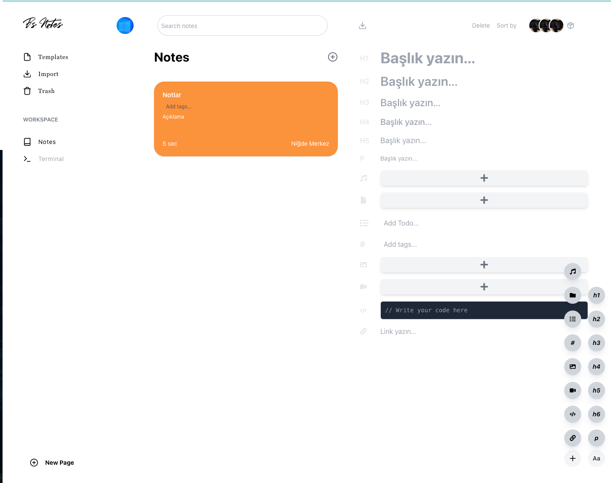

# BSNote - Advanced Note-Taking Application ✍️

**BSNote** is a powerful and user-friendly note-taking application developed using modern technologies to provide a seamless and feature-rich experience for users. It’s designed with scalability and performance in mind, combining React.js for the frontend and .NET 8 for the backend.

## 🌟 Features

- **Modern UI**: Built with Tailwind CSS for responsive, clean, and customizable designs.
- **Animations**: Smooth transitions and animations powered by Framer Motion.
- **Search and Organize**: Easily search, tag, and organize notes.
- **Authentication**: Secure login and user account management with .NET Identity.
- **Cross-platform**: Fully optimized for tablet, and desktop screens.

---

## 🛠 Technologies Used

### Frontend

- **[React 18](https://reactjs.org/)**: A JavaScript library for building user interfaces.
- **[React Router](https://reactrouter.com/)**: For routing and navigation.
- **[Framer Motion](https://www.framer.com/motion/)**: For animations.
- **[Tailwind CSS](https://tailwindcss.com/)**: A utility-first CSS framework.
- **[Axios](https://axios-http.com/)**: For making API requests.
- **[Prism.js](https://prismjs.com/)**: For syntax highlighting.

### Backend

- **[.NET 8](https://dotnet.microsoft.com/)**: For building robust and scalable APIs.
- **[Entity Framework Core](https://learn.microsoft.com/en-us/ef/)**: For database management and operations.
- **[MySQL](https://www.mysql.com/)**: For data storage.

---

## 📸 Screenshot

---

## 🛠 Installation and Setup

Follow these steps to set up the project locally:

## Available Scripts

In the project directory, you can run:

### `npm start`

Runs the app in the development mode.\
Open [http://localhost:3000](http://localhost:3000) to view it in the browser.

The page will reload if you make edits.\
You will also see any lint errors in the console.

### `npm test`

Launches the test runner in the interactive watch mode.\
See the section about [running tests](https://facebook.github.io/create-react-app/docs/running-tests) for more information.

### `npm run build`

Builds the app for production to the `build` folder.\
It correctly bundles React in production mode and optimizes the build for the best performance.

The build is minified and the filenames include the hashes.\
Your app is ready to be deployed!

See the section about [deployment](https://facebook.github.io/create-react-app/docs/deployment) for more information.

## 🌍 Live Demo

Check out the live version of the project here:  
[https://bsnote.buraksaglik.com/](https://bsnote.buraksaglik.com/)

Demo account:
Email: demouser@gmail.com
Password: 123456
